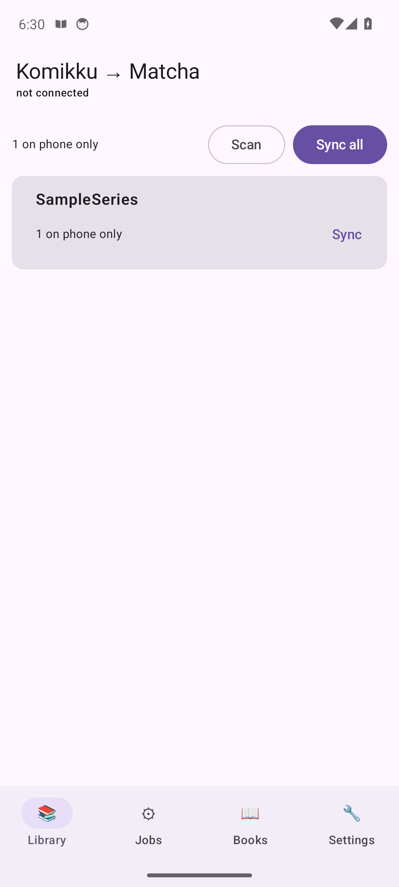
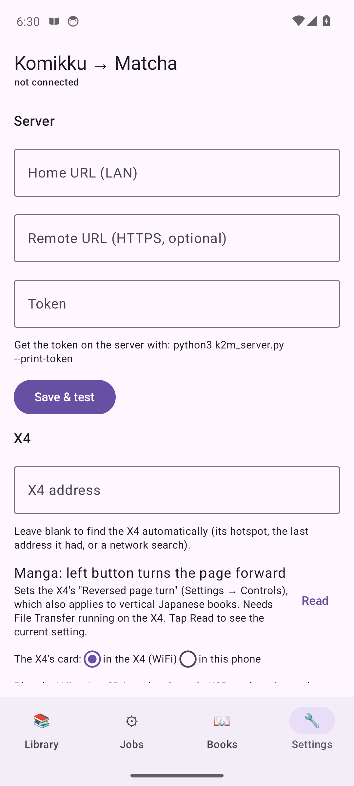

# komikku2matcha

Turns chapter CBZs downloaded by Komikku (or Mihon/Tachiyomi) into [Matcha Reader](https://github.com/eszter007/matcha-reader)
manga books for the Xteink X4 / X4 Pro, using Matcha's own converter (`tools/manga_convert/convert_manga.py`).

```
<input>/.../<Title>/<Chapter>.cbz   →   <output>/manga/<Title>/<Chapter>/{page_*.jpg, panels/, panels.idx, panels.dat, meta.bin}
```

Files, kept together in one folder: `komikku2matcha.py` (the tool), `covers.py` (cover pages and series art),
`local_ocr.py` (free local OCR, the default), and `matcha_ocr_shim.py` (optional Gemini OCR).

Copy `<output>/manga/` to the SD card. The device Library picks up any folder containing `panels.idx`, at any depth,
and `manga/<Title>/` shows up as a shelf.

## Setup

```bash
git clone https://github.com/eszter007/matcha-reader.git     # next to this folder, or pass --converter
python3 -m venv .venv
.venv/bin/pip install --index-url https://download.pytorch.org/whl/cu128 torch torchvision   # NVIDIA GPU
# no NVIDIA GPU: use https://download.pytorch.org/whl/cpu instead
.venv/bin/pip install ultralytics huggingface_hub Pillow mokuro
```

The converter needs only Pillow. `ultralytics` + `huggingface_hub` add the YOLO panel detector. Without them it falls back
to a white-gutter heuristic, which found about 1 panel per page on real scans against about 4.5 with YOLO, so panel zoom
is next to useless without it. `mokuro` brings the local OCR models; they download on first use (about 450 MB, into
`~/.cache/huggingface`). Run with `--python .venv/bin/python` to use the venv.

With the CUDA build of PyTorch, panel detection and OCR run on the GPU automatically; check with
`.venv/bin/python -c "import torch; print(torch.cuda.is_available())"`. Use the GPU if you have one. On the CPU, OCR is
heavy sustained load: on the test server it pushed the CPU to 93 °C within about 90 s, even capped to 4 cores. On a GTX
1660 Super the CPU stayed at its idle temperature and the GPU peaked at 47 °C. Any CPU work is capped by `--threads`
(default 4) and runs at low priority.
ImageMagick (`magick`) is used as a fallback for formats this Pillow build can't decode (AVIF, HEIF, JXL).

## Usage

```bash
K=./komikku2matcha.py; IN=/mnt/14TBHDD2/Manga_kommiku; OUT=~/matcha-out; PY=--python=.venv/bin/python

$K $IN $OUT --diagnose                    # what's in each CBZ (formats, nesting, junk); writes nothing
$K $IN $OUT --dry-run --language ja $PY   # diagnosis + what would be converted/skipped; writes nothing
$K $IN $OUT --language ja $PY --notify    # convert with free local OCR, Gotify message when done
$K $IN $OUT --language ja $PY --test      # just the first 3 pages of one chapter, into $OUT/_test/
$K $IN $OUT --language ja $PY --no-ocr    # panels only, no text
$K $IN $OUT --language ja $PY --reocr     # later: add OCR to books converted without it

# Paid Gemini OCR instead (check cost on a few pages first)
export GEMINI_API_KEY="$(tr -d '[:space:]' < $IN/GEMINI_API_KEY.txt)"
$K $IN $OUT --language ja $PY --ocr gemini --test --test-pages 5 --only "Chapter 80.1"

$K $IN $OUT --merge --language ja $PY     # one book per title instead, with a chapter list
$K $IN $OUT --only "kumo desu" $PY -- --trim-margins   # filter; args after -- go to convert_manga.py
```

| Flag | |
| --- | --- |
| `--language ja` | Book language. Tells OCR what to expect and splits reading stats by language. Komikku's ComicInfo has no `LanguageISO`, so set it. |
| `--merge` | One book per title at `manga/<Title>/` holding every chapter, with a chapter table of contents. Default is one book per chapter. |
| `--ocr local\|gemini\|off` | Where the text for dictionary lookup comes from. `local` (default) is free and Japanese-only; `gemini` is paid and needs `GEMINI_API_KEY`. See below. |
| `--no-ocr` | Same as `--ocr off`. |
| `--test [--test-pages N]` | First N pages (default 3) of the first selected chapter, written to `<output>/_test/` and never recorded as done. Reports text blocks and time, plus Gemini calls and tokens with `--ocr gemini`, and an estimate for the whole input. |
| `--thinking LEVEL` | `--ocr gemini` only: thinking level, `minimal` (default), `low`, `medium`, `high`, or `default` (the model's own). |
| `--translate` | `--ocr gemini` only: also request an English translation per panel. |
| `--only TEXT` | Only chapters whose `<title dir>/<file name>` contains TEXT. Repeatable. With `--merge` it picks titles, and a volume always holds all chapters. |
| `--diagnose` / `--dry-run` | Report only / report plus plan. Neither writes anything. |
| `--force` | Reconvert even if already done. |
| `--reocr` | With OCR on, also reconvert books whose earlier conversion has no OCR text. |
| `--device x4\|x3\|original` | Screen to downscale to. Default `x4` (480×800), which also fits the X4 Pro (same 800×480 panel; the converter has no separate X4 Pro profile). |
| `--threads N` | CPU cores for panel detection and OCR when they run on the CPU (default 4). |
| `--python`, `--converter`, `--tmp-dir` | Converter interpreter, converter path (also `$MATCHA_CONVERTER`), extraction dir. |
| `--notify` | Send the summary via Gotify (`~/.config/gotify/cli.json`). |
| `-v` | Show the converter's own output. |

Exit code: 0 if nothing failed, 1 if something failed, 130 on Ctrl-C.

## What it does per chapter

1. **Diagnose.** It reads the archive's entries and identifies each one **by its magic bytes**, not its extension.
   Komikku mislabels pages: in the test library, every `.webp` in one chapter was really a JPEG.
2. **Normalize** (in a temp dir; the CBZ is only read):
   - flattens any folders
   - drops non-images (`ComicInfo.xml`, `.nomedia`, `__MACOSX/._*`, `Thumbs.db`) and zip-slip paths
   - keeps JPEG/PNG/WebP/BMP, which `convert_manga.py` reads (its `IMAGE_EXTS`)
   - converts PNG and everything else (AVIF, HEIF, GIF, TIFF, JXL) to baseline JPEG: the X4 often can't decode
     PNG pages mid-chapter
   - fully decodes every page, so a truncated download fails the chapter with the page's name instead of crashing
     the converter halfway through
   - renames pages `0001.ext`… in natural order (`2` before `10`, folder path included)
3. **Convert.** It runs `convert_manga.py --input <pages> --x4 --title "<Series> - <Chapter>" --author <Writer> --language …`.
   Title and author are passed explicitly: the converter only reads ComicInfo from a `.cbz` input, and this passes a
   folder.
4. **Install.** The result is moved into place through a `.partial` folder and a rename, so an interrupted run never
   leaves a half-written book that the device would still list. Done books are recorded in
   `<output>/.komikku2matcha-state.json` along with each source's size and mtime. Reruns skip them unless the CBZ changed
   (for example, it was re-downloaded) or the book folder was deleted.

Folder names come from Komikku's folder and file names. The script strips Mihon's `_<6 hex>` uniqueness suffix
(`Chapter 79.2_f6981c` becomes `Chapter 79.2`) unless that would cause a collision. Characters FAT/exFAT can't store
are replaced with `_`. If two sources have the same title, the second gets ` (<source>)` appended.

Each book's display title is `<Series> - <Chapter>`, with whole numbers zero-padded to a common width across the title
(`Chapter 09`, `Chapter 10`). This matters because the shelf view sorts books by title with a plain string compare
(`CoverLibraryActivity::loadShelfBooks`), which would otherwise put `Chapter 10` before `Chapter 9`. When a new chapter
widens the numbering (99 → 100), later runs rewrite the older books' `meta.bin` titles in place; no reconversion or OCR
is needed. At the end of a chapter, the "next book" suggestion (`NextBookFinder`) natural-sorts the sibling folders, so it
offers the following chapter.

A merged volume orders chapters by ComicInfo `<Number>`, then by natural file name. It leaves out chapters it can't read,
lists them as failed, and warns about them on every later run. It is rebuilt when a chapter is added or changes.

## OCR

### Local (default, free)

`local_ocr.py` uses [Mokuro](https://github.com/kha-white/mokuro)'s stack: comic-text-detector finds text blocks and each
printed line, and [manga-ocr](https://github.com/kha-white/manga-ocr) reads each line. The converter first runs with
`--no-ocr`, then the worker:

1. OCRs the **full-resolution** source pages, not the screen-sized crops the converter keeps; small text needs the pixels.
2. Scales the boxes to the book's page size and puts each text block into the panel it overlaps most.
3. Orders the blocks with the converter's own reading-order sort, and each block's lines right to left.
4. Writes `panels.dat`/`panels.idx` with the converter's own `encode_page()`, so the format always matches.

It normalizes manga-ocr's `．．．` to `…` and full-width Latin letters and digits to ASCII. The models load once per run
(about 15 s), then each page takes about 2 s on CPU, less on a GPU.

Measured against Gemini on the same pages: the speech-bubble dialogue was the same. Local was sometimes better
(Gemini produced garbled duplicate blocks on one page and misread one kana) and sometimes worse:
- it can read 〝 〟 quote marks as kana (`嫌がらせ` became `を…嫌がらせん`) and drop 〈 〉 brackets
- it misses some sound effects and map labels
- where furigana touches a line, it can pick it up too (`わたし私も`)

There are no English translations, which dictionary lookup doesn't need. It reads Japanese only. It can't be combined
with `--webtoon` or `--trim-margins`, because those change the pages the text is mapped onto.

### Gemini (`--ocr gemini`, paid)

Gemini OCR runs through `matcha_ocr_shim.py`. The shim loads the upstream converter unmodified, swaps out its Gemini call and
prompt, and then runs it. It does four things:

- **Thinking set to `minimal`** (`--thinking`). The converter sends no thinking setting, so the model thinks before
  answering, and those tokens are billed as output. Measured on the test library:

  | Per panel | Input tokens | Output tokens (incl. thinking) | Time per page |
  | --- | --- | --- | --- |
  | Converter default, with translation | ~1,435 | ~1,816 | ~12 s |
  | `--thinking minimal`, text only (script default) | ~1,400 | ~363 | ~4.5 s |

  The text came out the same, and the line boxes still sit on the text columns. With little thinking, the outer box
  of a speech bubble sometimes came back too short, so the shim widens each bubble's box to cover its lines.
- **Text only.** Dictionary lookup needs only the text, so no translation is requested. Pass `--translate` to get
  English translations back.
- **The key never appears on a command line.** It goes to `curl` on stdin (`-H @-`), where upstream passes it as an
  argument that anyone on the machine can see in `ps`. It's read only from `GEMINI_API_KEY`, never written to disk, the
  state file or the output, and masked if it ever shows up in converter output. With OCR off, it's removed from the
  converter's environment.
- **Failures are visible.** Upstream silently leaves a panel empty after 3 failed retries (429/503). The shim prints a
  warning instead, and the script flags any book that came back with 0 text blocks. Rerun with `--reocr` once your
  quota recovers.

Each converted chapter reports its token counts, and `--test` extrapolates them to the whole input. Multiply by your
model's prices (`gemini-3.6-flash`, set in the converter) to get the cost. Input tokens now make up most of the bill,
and those are one call per panel, about 4.5 per page.

If the upstream converter renames the functions the shim replaces, the script stops at startup and names them;
nothing fails halfway through.

Measured cost for reference: about $4 for the 9-chapter test library, 6 chapters at the converter's defaults and
3 with the settings above.

## Why the browser converter said "No image files found in the selection"

Matcha Reader Tools (`js/manga-ui.js`, `collectPagesFromInput`) only opens a CBZ when **exactly one** file is selected.
Selecting several CBZs, or a folder of them, makes it treat the selection as loose image files. It filters those by
`.jpg/.png/.webp/.bmp`, finds none, and shows that error. An unreadable CBZ gives "…in the archive" instead. WebP pages
and ComicInfo.xml weren't the problem, since both tools accept WebP.

## Android app + server

<p>
  
  
</p>

`k2m_server.py` wraps this tool in a small token-protected HTTP API. `android/` is an app that drives it from your phone:

- **Library:** scans Komikku's download folder on the phone, compares it with the server, uploads chapters that are new
  or re-downloaded, and converts everything not yet converted (**Sync all**, or **Sync** per title).
- **Jobs:** shows conversion and send jobs with progress, and can cancel them. While a job started from the app is
  running, a notification shows progress, and a second one reports the result (converted / skipped / failed, with
  reasons). This works with the app closed; the phone just needs to be able to reach the server.
- **Books:** converted books by title. **Download** saves a zip to `Downloads/Matcha/` that unpacks to
  `manga/<title>/<chapter>/`, ready for the SD card. **Save to phone** downloads books into the app for sending
  later with no internet. **Send to X4** copies the books over WiFi. It first saves them on the phone (skipping any
  already saved), then checks once that the X4 answers, failing within seconds with a clear message if it doesn't.
  Books that reach the X4 are removed from the phone again:
  - **from the phone:** connect the phone to the X4's own WiFi (`CrossPoint-Reader`, the X4 is `192.168.4.1`) or
    put both on the same WiFi. X4 traffic is pinned to WiFi, so on the X4's hotspot (no internet) the phone still
    reaches the server over mobile data. With no mobile data either, use **Save to phone** beforehand.
  - **from the server:** the X4 must be on your home WiFi
  Start **File Transfer** on the X4 first. **Find X4** locates it (the phone and the server both look), or type its
  IP. Books already on the X4 are skipped unless you tick *Replace*. `panels.idx` is copied last, so an interrupted
  copy never shows up in the X4's library.

**Cover pages and series covers.** The X4 uses a chapter's first page as its Library cover (and a shelf shows its
most recently opened book's cover); there's no separate cover file. So each chapter gets a generated first page:
the series' art with the chapter number in large type, drawn at the target screen size (`covers.py`). Art comes from
AniList (free, no key; looked up by series title with suffixes like " - RAW" dropped) and is cached in
`OUTPUT/.covers/`. In the app, a title's ⋯ menu can **Change cover…** (your own image), go back to AniList's, or
search AniList again. Changing art redraws only the first page of each converted chapter; sending then updates just
that file on the X4 (plus clearing its cached thumbnail). Turn it off with **Cover page with chapter number**
(Settings) or `--no-cover-page`.

**Komikku's covers.** Komikku doesn't store covers with its downloads, but its automatic backups
(`<Komikku folder>/autobackup/*.tachibk`, a gzip'd protobuf) list each manga's cover URL. When the app is given
Komikku's main folder (holding `downloads` and `autobackup`), it reads the newest backup after each scan, matches its
titles to your series (ignoring punctuation), and the server downloads those covers. Priority: your own cover, then
Komikku's, then AniList's.

**Delta sync.** Sending a chapter that's already on the X4 transfers only what differs: files that are missing,
a different size, or changed since they were last sent (the server's manifest carries a SHA-1 per file, and both the
app and the server remember what they sent to each X4 folder). Book files the chapter no longer has are deleted. When
pages change, `panels.idx` is removed first and put back last, so the X4 never lists a half-updated chapter; a
cover-only change stays listed throughout. **Replace books already on the X4** still forces a whole copy. Fix
problems uses this for everything: a re-converted chapter, a damaged or incomplete X4 copy, or a new cover page
sends only the pages that changed.

**Fix problems** also reports cover problems: chapters without a cover page, cover pages drawn without series art,
and ones showing older art than is now available. Fixing looks art up (Komikku, then AniList), then redraws just the
first page; bad pages still get a full re-conversion. On the X4, redrawn covers are updated in place (one file), and
damaged or re-converted chapters get only their changed files (see Delta sync).

**App updates.** `android/publish.sh` builds the app and publishes it with a version file (`komikku2matcha.apk.json`,
served at `/api/app/version`). The app checks when it opens and during automatic sync, and shows **Install** (or
installs by itself with *Install updates automatically*, the default). The download is checked against the published
SHA-256, and Android only accepts it if it's signed with the same key. The first time, Android asks to allow "Install
unknown apps" for the app; after that, Android 12+ usually updates without a prompt.

**Page turn direction.** Settings → X4 → *Manga: left button turns the page forward* reads and sets the X4's own
"Reversed page turn (Vertical & Manga)" setting over WiFi (it also applies to vertical Japanese books).

**The SD card in the phone.** Plug the X4's microSD into the phone (a USB-C card reader, or a card slot) and pick
its root in Settings → *The X4's card: in this phone* (also on the Books tab's X4 card). Sends then write straight to
the card, at card-reader speed instead of the X4's WiFi (~0.3 MB/s), and Check X4, Clean up read, Fix problems,
Sync read status and Delete work on it the same way. Put the card back in the X4 and it picks the changes up.
Everything goes through one small storage interface (`X4Storage`: list, read, write, mkdirs, delete) with a WiFi
version (`WebDavStorage`) and a card version (`SafStorage`, Android's storage access framework), so the book logic
(`BookOps`: delta sync, `panels.idx` last, render caches, progress files) is the same for both.

**Read status between the X4 and Komikku.** Books → **Sync read status…** compares what's finished on the X4 (its
own "last page reached" rule) with what Komikku has marked read (from its newest backup), matching chapters by
Komikku's download names: the `_<md5(url)[:6]>` suffix when present, else the chapter name.
- *Read on the X4 → Komikku:* no app can write Komikku's database, so the app saves a small backup to Downloads
  containing just those manga, copied from Komikku's own backup with those chapters marked read, and opens Komikku;
  restore it there (Settings → Data and storage → Restore backup). Komikku's restore keeps a chapter read if either
  side says so, so this only ever adds "read".
- *Read in Komikku → X4:* marked finished on the X4 exactly like its own "mark as read" (`progress.bin` = page count,
  written through the web UI's /mkdir, /delete and /upload, which reach `.crosspoint`). Clean up read can then
  remove them.
The Send dialog can also skip chapters already read in Komikku.

**Deleting.** Books → select → **Delete…**: from the server (a queued job), from the X4, and optionally *don't sync
again*, which deletes the uploaded CBZ and remembers the chapter (or the whole series, future chapters too) so the
phone won't upload it again. The Library's ⋯ menu has *Sync again* to undo that.

**Covers.** Tap a series cover to pick one: yours, Komikku's, several AniList matches, or the first page of the
first or latest chapter, or upload your own.

**Progress and estimates.** Conversions report pages done and time left (from this job's speed, or recent jobs'
before the first chapter finishes). Sends plan every chapter against the X4 first, download only the files that
will be sent, and show the chapter, file, MB left and time left.

**X4 / X3.** Settings → Conversion picks the screen: X4 and X4 Pro (480×800) or X3 (528×792). Chapters converted for
the other screen, or with the other cover setting, count as not converted and are converted again on the next Sync.
Fix problems flags them too.

**Finding the X4.** Leave the X4 address blank (the default) and the app finds it: the last address it answered at,
the WiFi gateway (on the X4's own hotspot that's the X4), a UDP discovery broadcast, then `192.168.4.1`. Only a
WebDAV answer counts, so a reused address isn't mistaken for the X4.

**Transfer rate.** While uploading, downloading or copying to the X4, a tile under the progress line shows the current
rate, average, peak and total, with a one-minute sparkline; drag across it to read an earlier moment.

**Check X4** (Books tab) reads the X4's SD card over WiFi: each chapter shows *on X4*, *older on X4* (a different
conversion, e.g. a no-OCR copy) or nothing, and **Select not on X4** picks everything missing or outdated. Manga
and EPUB/XTC/TXT books the server doesn't know are listed under *Only on the X4*. Sends keep this list up to date.

Books already on the X4 are recognised even under other folder names (copied by hand, say): by path ignoring case
(the SD card ignores it), then by the chapter's `meta.bin` title, then by chapter folder within a similarly named title
folder. **Select not on X4** picks only what's missing; **Select outdated** picks chapters whose X4 copy is another
conversion, and sending them replaces that copy where it is rather than adding a duplicate. Titles are collapsed;
tap one to see its chapters. **Cancel** (next to the progress line, or on the notification) stops an upload, send or
job; a half-copied chapter is removed from the X4.

**Fix problems…** (Books tab) runs the server's check of every chapter: pages that don't decode, a page count that
doesn't match `panels.idx`, progressive JPEGs, and PNG pages. The X4 decodes PNG with a ~40 KB decoder that needs one
contiguous block of memory, which mid-chapter often isn't free, so the page shows "page load error". With the X4
reachable, it also compares each X4 copy that looks up to date with the server's, file by file (missing, damaged,
stray pages). **Fix** re-converts the chosen chapters from their CBZ, then replaces them on the X4 in place. Replacing
a chapter also clears its cached page images on the X4, keeping the reading position.

Check X4 also finds **incomplete chapters**: folders with pages but no `panels.idx`, typically left by an interrupted
copy. The X4 only lists a folder as a book once `panels.idx` is in it, so these don't appear on its shelves at all.
Fix problems sends each one again in place, or deletes it if it matches no book on the server.

New conversions never contain PNG pages: PNG (and anything the converter can't read) becomes a baseline JPEG first.
Versions are compared by a fingerprint of each chapter's file names and sizes, so a page-only change counts as
"older on X4".

**Clean up read…** (Books tab) reads each manga's reading position from the X4 and lists what you've finished
(the X4's own rule: you reached the last page, or used "mark as read"), ticked, and what's in progress, with how far
you got, unticked. Confirming deletes the ticked books from the X4 along with their saved position and cover
thumbnail; they stay on the server, so you can send them again. The position comes from
`/.crosspoint/manga_<hash of the book path>/progress.bin`. The hash is libstdc++'s 32-bit `std::hash`, which the
app reimplements and checks against g++ output. EPUB/XTC books aren't covered yet.

**Automatic sync** (Settings): every 1/6/12/24 hours, scan Komikku's folder, upload what's new and convert it,
with a notification when the conversion finishes. With *Only on the home network* (default) it only talks to the
Home URL, so away from home a run just records "skipped" and uses no mobile data; *Only while charging* is optional.

The app tries the home URL first and falls back to the remote one. The server only runs the free local OCR.

### Server setup

```bash
git clone https://github.com/schindlershadow/komikku2matcha.git && cd komikku2matcha
./install.sh
```

That is the whole setup, with no questions: it makes the Python environment (CUDA PyTorch if it finds an NVIDIA
GPU, else CPU), fetches the converter, writes a config, starts the server as a systemd user service, opens the port
in `ufw` if that is running (asks for sudo), downloads the latest release APK, and ends by printing the URL and token
to type into the app. Options: `--minimal` (no PyTorch/OCR, much smaller), `--input`/`--output` (folders),
`--no-firewall`, `--uninstall`. Running it again is safe.

Then manage it with:

```bash
systemctl --user status k2m-server        # runs k2m_server.py; config in ~/.config/k2m-server/config.json
python3 k2m_server.py --print-token       # the token to paste into the app
journalctl --user -u k2m-server -f        # log; job logs are in ~/.local/state/k2m-server/logs/
```

The installer already runs `sudo ./setup-root.sh` for `ufw` (LAN access to the server, plus the X4's discovery replies
on source port 8134 for "Find X4"); it detects your subnet, or set `LAN=192.168.x.0/24`. For remote access behind Apache, also pass `sudo -E env APACHE_CONF=/etc/apache2/sites-available/<ssl-vhost>.conf
APACHE_ANCHOR='<an existing line in it>' HOST=<your.domain> ./setup-root.sh`, which inserts a `/matcha/` proxy route
(with a backup, `configtest` and rollback). Or add these two lines to the SSL `VirtualHost` yourself and reload:
`ProxyPass /matcha/ http://127.0.0.1:8765/` and `ProxyPassReverse /matcha/ http://127.0.0.1:8765/`.

Every API call except `/api/health` needs the token; a wrong one gets a 401 after a short delay. Uploads accept
only `.cbz` zips with plain file names, and pushes only go to LAN IP addresses.

### App

The installer puts the release APK next to `k2m_server.py` and the server hands it out at `http://<server>:8765/app.apk`
(if no release exists yet, build it below and copy it there as `komikku2matcha.apk`). Open that on the phone and allow installs from your browser when asked. In **Settings**:

- Home URL `http://<server-ip>:8765` (the installer prints it), Remote URL if you set up remote access, and the token.
  Tap **Save & test**.
- **Pick Komikku download folder:** the folder Komikku downloads into (`<source>/<title>/<chapter>.cbz` inside).
  The app only reads it.

Publish a new version with `android/publish.sh` after bumping `versionCode`/`versionName` in
`android/app/build.gradle.kts`; it also uploads the APK and its version JSON to a GitHub release `v<version>` (needs `gh`; set `K2M_REPO=owner/repo`, skipped if the repo doesn't exist yet). The app's update check looks at both the server and the latest GitHub release and takes the newer, so it updates without a server too. Build it yourself with `cd android && ./gradlew assembleRelease` (optimized and signed with the key in
`~/android-build/k2m-keystore.properties`; much smoother than `assembleDebug`). Back up that key: an update signed
with a different key can only be installed after uninstalling the app. It needs JDK 17+ and the Android SDK (platform 36,
set in `local.properties`). `android/android-test.sh` runs the on-device tests on a headless KVM emulator (AVD `k2m_test`) and always shuts it down afterwards. `tests/run-android-tests.sh` runs all app tests against a throwaway server and a fake X4 (`tests/fake_x4.py`,
which follows the firmware's WebDAV rules), cleaning up after itself.
